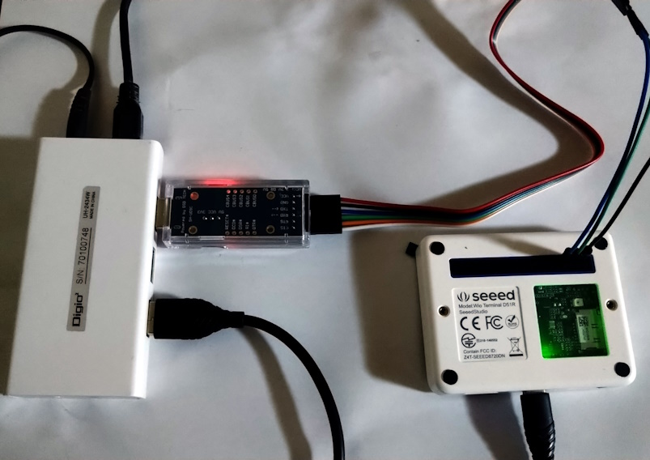

# ch06_p184_01_uart
[基礎から学ぶ 組込みRust](https://www.c-r.com/book/detail/1403)6章P184のシリアル通信で「hello wolrd」の文字列を送信するプログラムを```wio-terminal = "0.6.1"```で書いてみました。

### 機器の接続

### 実行結果


# 購入品
[Wio Terminal](https://akizukidenshi.com/catalog/g/gM-15275/)に加えて下記の製品が必要です。

| 機材名 | 数量 | URL |
| ---- | ---- | ---- |
| USBシリアル変換モジュール(3.3V) | 1個 | [アマゾン](https://www.amazon.co.jp/gp/product/B07BBPX8B8/ref=ppx_yo_dt_b_asin_title_o01_s00?ie=UTF8&psc=1) |
| ジャンパワイヤ(オスオス) | 3本 | [アマゾン](https://www.amazon.co.jp/gp/product/B08B63VNCH/ref=ppx_yo_dt_b_asin_title_o00_s00?ie=UTF8&psc=1) |

# 開発ツールの追加
Windowsのシリアル通信を制御する[Tera Term](https://ja.osdn.net/projects/ttssh2/releases/)をインストールしてください。

# プログラム実行前の準備
## シリアルポートの確認
Windowsの場合コマンドプロンプトを使用します。
USBシリアル変換モジュールを接続する前後で```mode```コマンドを実行してシリアルポートの名称を確認します。

### USBシリアル変換モジュール接続前

### 接続後


## Tera Term の設定
シリアル通信を扱う場合 Tera Term を起動しておく必要があります。
### 起動時にポートを設定する

### Tera Term の設定
下記の画像のように設定してください。


## ジャンパワイヤの接続
Wio Terminal の背面側の上側右から3番目がGND、4番目がTXD(送信)、5番目がRXD(受信)です。
これに対してUSBシリアル変換モジュールのGND、RXD、TXDをつないでください。
### USBシリアル変換モジュール

### Wio Terminal の背面


# プログラム実行
Wio Terminal をブートローダーモードにして```cargo hf2```を実行するとプログラムを実行できます。
