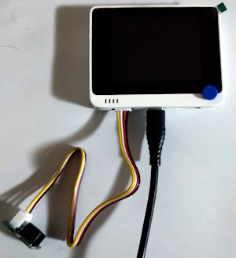

# ex_grove_01
Wio Terminalに[GROVE - ブザー](https://www.switch-science.com/products/804)を接続して起動時にブザーを鳴らすプログラム。

# 接続方法
正面から見て左側の Grove 端子にブザーを取り付ける。



# 外部機器への接続に関する雑感
抽象化しやすい```wio_terminal::Sets```よりも、ベタ打ちしやすい```wio_terminal::Pins```で書いた方が分かりやすい。

外部機器を使用する時は[Wio Terminal の Wiki](https://wiki.seeedstudio.com/Wio-Terminal-Getting-Started/)のピン番号に対応する[ピンインスタンス](https://docs.rs/wio_terminal/0.6.1/wio_terminal/struct.Pins.html)を確認すると良い。