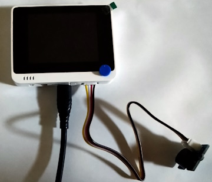

# ex_grove_02
Wio Terminalに[GROVE - ブザー](https://www.switch-science.com/products/804)を接続して起動時にブザーを鳴らすプログラム。

# 接続方法
正面から見て**右側**の Grove 端子にブザーを取り付ける。



# 外部機器への接続に関する雑感
どうやら右側の Grove 端子を使用する場合```wio_terminal::Sets``` 構造体の ```header_pins``` フィールドからピンのインスタンスを呼び出せるようだ。

[Seeed K.K. エンジニアブログ](https://lab.seeed.co.jp/entry/2021/04/30/180000)より左側の Grove 端子に対応する```wio_terminal::Sets``` 構造体のフィールドが無いようだ。

外部機器を使用する時は[Wio Terminal の Wiki](https://wiki.seeedstudio.com/Wio-Terminal-Getting-Started/)のピン番号に対応する[ピンインスタンス](https://docs.rs/wio_terminal/0.6.1/wio_terminal/struct.Pins.html)を確認すると良い。